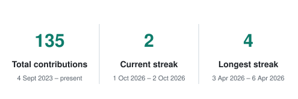

<h1 align="center">Hi, I'm Daniel </h1>

<p align="center">
  
</p>

<p align="center">
  <a href="mailto:chadambukadaniel@gmail.com"></a>
  <a href="https://www.linkedin.com/in/daniel-chadambuka-792b74277"></a>
  <a href="https://dev.danielchadambuka.com"></a>
  <a href="https://fishtech.co.zw"></a>
  <a href="https://dev.danielchadambuka.com/#contact"></a>
</p>

---

###  About me

I'm a **BSc Computer Science graduate, NUST (2026)**, based in Harare, and the founder of **FishTech Consultancy**. I build software end to end: computer vision that runs offline on a Raspberry Pi at the side of a fish pond, the embedded control for a solar-powered feeder, and web platforms with online payments for local businesses.

Most of my work is shaped by local conditions: patchy connectivity, tight budgets, and users who need the thing to keep working when the internet doesn't.

```ts
const daniel = {
  role: "Software Engineer",
  location: "Harare, Zimbabwe 🇿🇼",
  education: "BSc Computer Science graduate, NUST (2026)",
  founder: "FishTech Consultancy",
  building: [
    "Iris: overhead-camera fish biomass and feeding recommendations",
    "FishTech Feeder: solar-powered automatic feeder on an ESP32",
    "web platforms with online payments",
  ],
};
```

---

###  Featured projects

#### Iris: FishTech Precision Feeding System
> An overhead camera reads fish length from above the pond. The system converts that to per-fish weight and whole-pond biomass, then produces a feed recommendation adjusted for fish size, water temperature, time of day and the response to the last feeding. It is built to run at the pondside on a Raspberry Pi with no internet.

- **Backend:** Python 3.11, FastAPI on uvicorn (migrated from Flask), SQLite in WAL mode. 210 backend tests (pytest).
- **Vision today:** YOLOv8 detector trained locally with Ultralytics on a self-collected demo-tank dataset; a read-only evaluation harness measures detection and count against labelled frames.
- **Vision next:** YOLO11-Pose with six keypoints per fish for length, ChArUco + ultrasonic calibration with Snell refraction correction, and ByteTrack tracking.
- **Hardware:** Raspberry Pi 5 with the Hailo-8L AI HAT+ as the target edge platform (AI HAT+ not yet procured); mast, boom and enclosure parts modelled as parametric CAD.
- **Dashboard:** React 19 + Vite + TanStack Router.
- **Status:** running on a demo tank, not yet piloted on a farm. Biomass accuracy is not yet validated; that waits on measured fresh-fish ground truth.

`Python` · `FastAPI` · `Ultralytics YOLO` · `PyTorch` · `OpenCV` · `SQLite` · `React` · `Raspberry Pi`

<sub>Private repository · demo on request</sub>

#### FishTech Feeder
> A welded mild-steel, solar-powered automatic fish feeder in two sizes, F10 and F25 (10 kg and 25 kg hoppers). It meters each dose by counting auger revolutions and broadcasts it over the water with a spinning disc. It works out the daily ration from fish size and water temperature, caps it to what the pond can carry, and runs standalone with no internet. It can also take a grams-per-feed instruction from Iris over Wi-Fi.

- **Electronics:** ESP32-WROOM-32 with a DS3231 real-time clock, hand-built IRF3205 MOSFET driver board, hall-sensor revolution counting on the hardware pulse counter, 20 W solar panel and 12 V battery.
- **Firmware:** Arduino under PlatformIO; bench bring-up sketch written, product firmware next.
- **Design:** parametric build123d model whose `verify.py` passes 450 geometry checks.
- **Status:** the two gating tests (dose and throw) have not been run yet; not yet piloted.

`ESP32` · `C++ / Arduino` · `PlatformIO` · `build123d` · `Python`

<sub>Private repository · demo on request</sub>

**Where it started:** [Smart-Fish-Feeding-System](https://github.com/DACDaniels/Smart-Fish-Feeding-System), my first computer-vision fish feeding prototype.

---

###  Other projects

#### [SteadyHands Catering Platform](https://github.com/DACDaniels/steadyhands-platform) · [steadyhandscatering.com](https://steadyhandscatering.com)
> Live site for SteadyHands @ Bata Club: menu, online ordering and catering enquiries.

- Online payments through the Paynow SDK.
- Built and deployed end to end.

`Next.js` · `TypeScript` · `Prisma` · `Paynow`

#### [FishTech Consultancy website](https://github.com/DACDaniels/fishtech-consultancy) · [fishtech.co.zw](https://fishtech.co.zw)
> Company site for fish pond construction services in Zimbabwe, kept light for slow mobile connections, with enquiries routed to WhatsApp.

`React` · `TypeScript` · `Vite` · `Framer Motion`

#### [Portfolio](https://github.com/DACDaniels/daniel-portfolio) · [dev.danielchadambuka.com](https://dev.danielchadambuka.com)
> My personal site, with a custom design system and scroll-driven motion.

`Next.js` · `TypeScript` · `Tailwind CSS v4` · `Motion`

---

###  Ventures

- 🐟 **FishTech Consultancy**: Founder & CEO
- 🎟️ **Ticket Kulture Zimbabwe (Pvt) Ltd**: Director

---

###  Milestones

- 📍 **2026**: Presidential Innovation Awards (participant)
- 📍 **Aug 2026**: Zimbabwe Agricultural Show, Harare (exhibited the FishTech Feeder)
- 📍 Zimbabwe Digital Economy Conference, Bulawayo (participant)

---

###  Experience

- **Founder & CEO**, FishTech Consultancy *(2024 – present)*
  Aquaculture services for Zimbabwean farmers, and the engineering behind Iris and the FishTech Feeder.
- **Industrial Attachment**, ZIMDEF *(May 2024 – Jun 2025)*
  Enterprise IT environment: SAP, data centre, ManageEngine, Microsoft 365, networking and support systems.
- **Freelance Software Engineer** *(2024 – present)*
  Web platforms with online payment integrations for local clients.

---

###  What I'm working on now

- **Keypoint-based fish measurement:** moving Iris from bounding boxes to YOLO11-Pose six-keypoint length measurement.
- **On-device inference:** the Raspberry Pi 5 + Hailo-8L deployment path for Iris (ONNX to HEF compilation).
- **Biomass validation:** measuring fresh fish to turn the pipeline's biomass output into a validated accuracy figure.
- **Feeder firmware:** ESP32 firmware for counted-revolution metering and the feeding schedule.

---

###  Tech stack

<p>
  
</p>

<details>
<summary><b>Full list</b></summary>

<br />

| Area | Tools |
|---|---|
| **Languages** | Python, TypeScript, JavaScript, C++ (Arduino), SQL, Bash |
| **Backend** | FastAPI, uvicorn, Flask, Node.js, Express, REST APIs, Pydantic |
| **Frontend** | Next.js, React, Tailwind CSS v4, Vite, TanStack Router / Query, Framer Motion |
| **AI / computer vision** | Ultralytics YOLO, PyTorch, OpenCV, Roboflow, NumPy, TensorFlow |
| **Databases** | SQLite, PostgreSQL, Prisma, MongoDB, MySQL |
| **Edge / embedded** | Raspberry Pi 5, ESP32, PlatformIO, Linux |
| **Hardware design** | build123d, CadQuery |
| **Testing** | pytest |
| **DevOps & tooling** | Git, GitHub, GitHub Actions, Vercel, Docker, Postman, VS Code |
| **Integrations** | Paynow, WhatsApp Business |

</details>

---

###  GitHub activity

<p align="center">
  <picture>
    <source media="(prefers-color-scheme: dark)" srcset="profile/stats-dark.svg" />
    
  </picture>
  <picture>
    <source media="(prefers-color-scheme: dark)" srcset="profile/top-langs-dark.svg" />
    
  </picture>
</p>

<p align="center">
  <picture>
    <source media="(prefers-color-scheme: dark)" srcset="profile/streak-dark.svg" />
    
  </picture>
</p>

<p align="center">
  <picture>
    <source media="(prefers-color-scheme: dark)" srcset="profile/snake-dark.svg" />
    
  </picture>
</p>

<p align="center"><sub>Generated daily by GitHub Actions in this repository. Counts public activity only.</sub></p>

---

###  Let's work together

I'm open to:

- 💼 **Full-time roles:** software engineering, full-stack, computer vision, edge AI (remote-first or Zimbabwe-based)
- 🛠️ **Freelance / contract work:** web platforms, payment integrations, custom systems
- 🧪 **Research collaborations:** applied computer vision, edge AI, agritech

📫 [chadambukadaniel@gmail.com](mailto:chadambukadaniel@gmail.com) · [LinkedIn](https://www.linkedin.com/in/daniel-chadambuka-792b74277) · [dev.danielchadambuka.com](https://dev.danielchadambuka.com/#contact)
